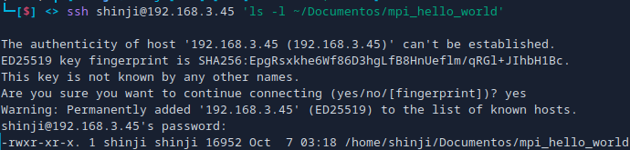

<div align="center">
  <h1>Cluster with MPI over LAN with FEDORA</h1>
</div>

<div align="center">

[](https://git.io/typing-svg)

</div>

<div align="center">
  
  
  
  
  
  


[]()


</div>

**Warning:** To execute this, all devices must use the same version of Fedora (39, 40, or 41).

This document details the necessary steps to configure OpenMPI and SSH on two computers (one Master and one Slave) and run a simple MPI program (Hello World).

## 1. Installation of Dependencies

On both computers (Master and Slave), open a terminal and execute the following commands to install OpenMPI and the SSH server:

```bash
# Install OpenMPI and its development libraries
sudo dnf install openmpi openmpi-devel

# Install the SSH server
sudo dnf install openssh-server
```

## 2. Configuration of Environment Variables

After installation, add the following lines to your shell configuration file (e.g., `~/.bashrc` or `~/.zshrc`) to ensure that the OpenMPI binaries are in your PATH and the libraries are in your LD_LIBRARY_PATH:

```bash
# Add OpenMPI to PATH
export PATH=$PATH:/usr/lib64/openmpi/bin

# Add OpenMPI to LD_LIBRARY_PATH
export LD_LIBRARY_PATH=$LD_LIBRARY_PATH:/usr/lib64/openmpi/lib
```

Reload your configuration file:

```bash
source ~/.bashrc   # Or source ~/.zshrc
```

## 3. Network Configuration

### 3.1 Obtain IP Addresses

Run the following command to see the IP addresses of the computers:

```bash
ip a
```

### 3.2 Edit the Hosts File

Edit the `/etc/hosts` file on both computers so they can resolve each other by name. Add the following lines:

```bash
# Open the file for editing
sudo nano /etc/hosts

# Add the following lines (replace with the corresponding IPs)
Master <master_ip_address>
Slave <slave_ip_address>
```


## 4. SSH Configuration

### 4.1 Generate SSH Keys

Generate an SSH key on the Master computer:

```bash
ssh-keygen
```

### 4.2 Verify the SSH Service

Ensure the SSH service is running:

```bash
sudo systemctl status sshd
```


If it is not active, enable and start it:

```bash
sudo systemctl enable sshd
sudo systemctl start sshd
```

### 4.3 Configure the Firewall

Allow SSH traffic through the firewall:

```bash
sudo firewall-cmd --permanent --add-service=ssh
sudo firewall-cmd --reload
```

### 4.4 Copy the SSH Key to the Slave

Run the following command on the Master computer to copy the SSH key to the Slave:

```bash
ssh-copy-id master_username@<slave_ip_address>
```


## 5. Programming and Running the MPI Program

### 5.1 Compile the Program

Change to the directory where you will save the code `helloworld.c` and compile it on both computers:

```bash
cd ~/Documents
mpicc helloworld.c -o mpi_hello_world
```




### 5.2 Execute the Program

Finally, run the MPI program from the Master computer using the following command (make sure the IPs are correct):

```bash
mpiexec --oversubscribe -n 20 -host <slave_ip_address>,<master_ip_address> ./mpi_hello_world
```

## Warning:

This will happen if the OpenMPI versions are not the same:

If the versions of OpenMPI on the Master and Slave nodes differ, it may lead to compatibility issues when running MPI programs. You may encounter errors or unexpected behavior during execution, such as processes not starting correctly or failure to communicate between nodes. It is essential to ensure that all devices are using the same version of OpenMPI to avoid these problems.


## Author

- **ShinjiMC** - [GitHub Profile](https://github.com/ShinjiMC)

## License

This project is licensed under the MIT License. See the [LICENSE](LICENSE) file for details.
